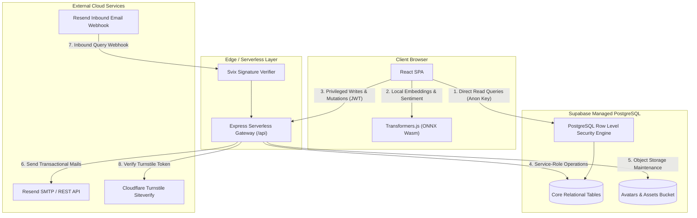
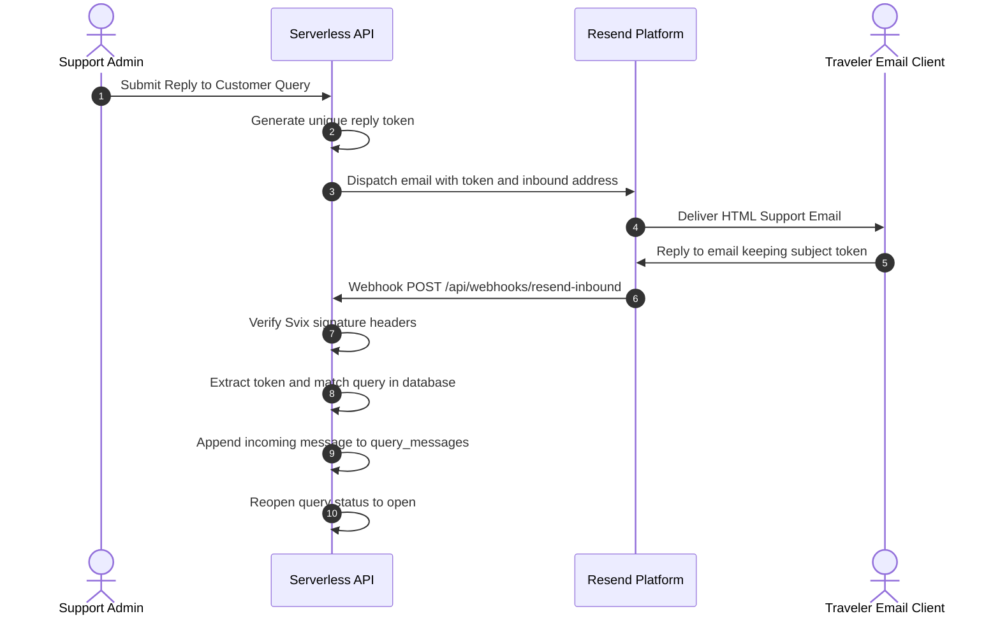

# System Architecture & Technical Implementation

> **Purpose Statement:** This is the technical/architecture documentation layer — written for a technical interviewer or a developer trying to understand how the system actually works internally. This is NOT marketing content, and it must contain NO folder/file structure tree — the focus is exclusively on concepts, data flow, and design reasoning, not directory layout.

---

## 1. Architecture Overview

Nicoman Tourism is structured around a decoupled serverless topology combining edge-hosted Single Page Application (SPA) clients, a unified Express serverless API gateway, managed PostgreSQL storage with fine-grained Row Level Security (RLS), and on-device machine learning inference. 

The architecture enforces a strict distinction between read and write data flows. Read paths bypass application middleware entirely: authenticated and anonymous frontend clients execute read queries directly against PostgreSQL via the Supabase Data API, with security enforced exclusively at the database layer via Postgres RLS policies. Write paths and privileged domain actions (such as account lifecycle events, webhook ingestion, transactional email dispatch, and cross-table batch mutations) route through an Express serverless function running with service-role permissions.



---

## 2. Database Design & Relational Schema

### 2.1 Core Relational Entities
The database schema partitions domain models into independent, strongly-typed tables:

* `profiles`: Extends `auth.users` with identity metadata, custom display names, verified phone numbers, avatar storage paths, and authorization roles (`user`, `admin`, `superadmin`, `demo_admin`).
* `hotels`: Catalog of lodging properties including geographical coordinates, star ratings, amenities arrays, and seasonal room price baselines.
* `tourist_places`: Island attraction directory categorized by geography, activity type, and best visiting seasons with rich media links.
* `ship_schedule`: Inter-island ferry timetable defining routes, vessel identities, departure timestamps, transit durations, class capacities, and tariffs.
* `bookings`: Hotel reservation records storing guest identity links, check-in/out timestamps, selected room allocations, total amounts, and fulfillment states.
* `ferry_bookings`: Vessel passenger reservations holding route metadata, allocated seat identifiers, departure dates, and passenger manifests.
* `feedback`: User-submitted reviews and ratings, annotated with on-device machine-classified sentiment tags (`positive`, `neutral`, `negative`).
* `customer_queries`: Support requests submitted through contact channels or inbound emails, tracked via deterministic alphanumeric thread tokens.
* `query_messages`: Individual conversational replies within a support query thread, recording sender classification (`customer` vs. `admin`) and Resend email message IDs.
* `alerts`: System-wide emergency travel notices, weather warnings, and schedule disruptions broadcast to all active clients.
* `deleted_profiles`: Thirty-day archival vault capturing complete profile states, user metadata, and historical relationships upon account self-deletion.

*(Note: The full executable DDL schema, indexes, and triggers are maintained in the project's migration SQL definitions).*

### 2.2 Row Level Security (RLS) Strategy
Authorization is enforced inside the PostgreSQL kernel rather than application code:

* **Public Catalogs (`hotels`, `tourist_places`, `ship_schedule`, `alerts`):** Configured with unrestricted `SELECT` policies for public access. `INSERT`, `UPDATE`, and `DELETE` policies require `auth.role() = 'authenticated'` combined with a role validation check:
  ```sql
  EXISTS (
    SELECT 1 FROM profiles 
    WHERE user_id = auth.uid() 
    AND role IN ('admin', 'superadmin')
  )
  ```
* **User Data Isolation (`bookings`, `ferry_bookings`, `customer_queries`):** Scoped by tenant identity:
  ```sql
  auth.uid() = user_id
  ```
  Users can view and manipulate only their own records, while administrators receive full select/update capabilities via service-role elevation or dedicated admin policies.
* **Separation of Presentation and Permission:** The frontend application conditionally renders UI elements based on client state, but PostgreSQL RLS independently guarantees that forged or modified client requests cannot read or mutate unauthorized rows.

### 2.3 Account Deletion & Cascading Archival
To support GDPR compliance and autonomous user privacy control, account deletion operates as a non-blocking cascade:

1. The client invokes `/api/user/account` with an authenticated Bearer token and Turnstile security token.
2. The server copies the user's current row from `profiles` into `deleted_profiles`, recording the exact deletion timestamp and an automated `scheduled_purge_at` timestamp set to `now() + 30 days`.
3. Profile storage assets (such as custom avatars) are removed from the `avatars` storage bucket.
4. The user's record in `auth.users` is deleted via `supabase.auth.admin.deleteUser()`, invalidating all active sessions.
5. Historical records (`bookings`, `ferry_bookings`) retain their referential integrity or transition to archived states, ensuring business metrics remain consistent while personal identifiers are scrubbed.

---

## 3. Authentication & Authorization

### 3.1 Dual-Layer Security Model
User authentication relies on Supabase Auth (GoTrue) implementing JSON Web Tokens (JWT) signed with HMAC-SHA256:

* **Sign-Up Defense:** Client registration requires valid email verification paired with Cloudflare Turnstile token validation. The turnstile token is validated server-side against Cloudflare's `/siteverify` endpoint before account creation proceeds, preventing automated bot generation.
* **Native OAuth Flow:** Google Sign-In is executed directly against Google Identity Services via OpenID Connect (OIDC). The resulting JWT ID token is exchanged with Supabase (`signInWithIdToken`), preventing unnecessary third-party redirects and avoiding exposure of internal database hostnames in the browser address bar.

### 3.2 Role Hierarchy & Demo Admin Pattern
The platform defines four discrete role levels:

* **Role Tier:** `user` &rarr; `admin` &rarr; `superadmin`
* **Preview Tier:** `demo_admin` (Isolated read-only simulation sandbox)

* **Superadmin:** Full operational access including privilege assignment, database purging, and administrator revocation.
* **Admin:** Operational CRUD access for schedules, places, lodging, feedback moderation, and customer support ticket resolution.
* **Demo Admin Pattern:** To allow prospective employers, reviewers, and recruiters to inspect management tooling without compromising production integrity, a dedicated `demo_admin` role is provisioned:
  * Demo admins can browse all administrative screens and view actual metrics.
  * Write endpoints intercept mutations from `demo_admin` credentials, returning synthetic success responses or displaying non-destructive informational notices while preserving real database state.

---

## 4. On-Device AI Architecture

### 4.1 Client-Side Sentiment Classification
User reviews submitted to the `feedback` system undergo automated sentiment scoring using a quantized Xenova DistilBERT model (`Xenova/distilbert-base-uncased-finetuned-sst-2-english`) executed directly in the browser via ONNX Runtime WebAssembly:

* **Reasoning:** Running inference on-device eliminates recurring third-party API token costs (OpenAI/Anthropic) and removes API latency from user interactions.
* **Execution:** Model weights are loaded lazily from CDN cache on first interaction and run entirely within a Web Worker, ensuring zero main-thread UI blocking.

### 4.2 Data-Grounded Chatbot
The interactive island guide assistant operates through a dual-stage local retrieval pipeline:

1. **Intent Classification:** Classifies incoming user queries into functional categories (Transit, Lodging, Sightseeing, Emergency, General) using regex heuristics and token similarity.
2. **Local Vector-Style Grounding:** Instead of generating unverified hallucinated answers, the assistant extracts real data directly from the active Supabase memory cache (`hotels`, `ship_schedule`, `tourist_places`) and formats structured responses containing real tariffs, routes, and timings.

---

## 5. Booking Handoff & Concurrency Control

### 5.1 Architectural Separation
The main tourism portal is designed as an authoritative informational platform, while the booking checkout engine operates as a dedicated reservation subsystem:

* **Reasoning:** In production travel architectures, informational discovery systems prioritize high-throughput caching and content delivery, whereas transactional booking flows require strict serializability, inventory locking, and payment gateway compliance. Decoupling the two prevents high browsing traffic from affecting transaction pipelines.

### 5.2 Deterministic Identifiers & Collision Prevention
When a reservation is submitted:

* A unique reference identifier is generated using the pattern:
  `[Prefix: HTL/FRY]-[Units Allocated]-ANI[5-char Random Hex]` (e.g. `HTL-Room101-ANI8F3K2`)
* **First-Come First-Served Lock:** Before persisting a booking record, the system queries active confirmed reservations for overlapping date ranges (`check_in < new_checkout AND check_out > new_checkin`). If a concurrent reservation claimed the selected room or ferry seat milliseconds earlier, the transaction is rejected with a conflict alert and the user is prompted to select another available unit.

---

## 6. Third-Party Integrations & Processing Pipelines

### 6.1 Transactional Email & Inbound Thread Matching
Customer support inquiries utilize the Resend REST API and Svix webhook signatures:



### 6.2 Browser-Side Image Compression Pipeline
Before profile avatars or media assets are transmitted to Supabase Object Storage, they pass through an HTML5 Canvas compression pipeline:

* Images are dynamically resized to a maximum bounding box (`800x800 px`) and re-encoded to WebP format at `82%` quality.
* **Reasoning:** Enforcing client-side compression reduces outbound mobile data consumption by over `75%`, minimizes storage bucket egress costs, and prevents large binary payloads from exhausting serverless execution memory limits.

### 6.3 Geospatial Mapping & Phased Pin Animations
Island maps utilize Leaflet with OpenStreetMap cartography:

* Precise GPS waypoints for ports, beaches, and historical landmarks are mapped to custom SVG markers.
* Marker rendering uses a staggered phase-in transition (`45 ms`) driven by Framer Motion, preventing layout thrashing when rendering complex multi-island transit networks.

---

## 7. Performance & Reliability Engineering

### 7.1 Dynamic Code-Splitting & Lazy Loading
All non-critical route components (`AdminDashboard`, `Profile`, `Bookings`) and heavyweight dependencies (Xenova Transformers, Leaflet) are packaged into isolated asynchronous chunks via dynamic `import()` boundaries. Initial bundle transfer is constrained to `<140 kB` gzip.

### 7.2 Scheduled Storage & Data Sanitization
Time-expiring records (such as soft-deleted accounts in `deleted_profiles` and expired system alerts) are purged using two complementary strategies:

1. **Passive Edge Cleanup:** Triggered during administrative dashboard hydration, identifying records where `scheduled_purge_at <= now()`.
2. **Serverless Cron Trigger:** An automated maintenance worker invoking cleanup routines independently to guarantee that stale records are wiped within the 30-day window even during periods of zero administrative traffic.

### 7.3 Motion Performance Guards
All continuous background animations and floating decorative elements are bound to viewport intersection observers. When an animated element is scrolled out of the visible screen area, animation loops are suspended to reduce CPU and GPU thread utilization to zero on mobile devices.

---

## 8. Known Limitations & Deliberate Scope Boundaries

| Architectural Area | Current Implementation | Engineering Trade-off & Rationale |
| :--- | :--- | :--- |
| **Payment Settlement** | Mock payment gateway simulation with instant state validation | Production payment integrations (Stripe/Razorpay) require verified business merchant banking entities and PCI-DSS compliance audits, which are intentionally out of scope for a portfolio demonstration platform. |
| **AI Model Size** | 8-bit quantized DistilBERT (`23 MB`) | Larger transformer models (`>500 MB`) provide marginal accuracy improvements at the cost of unacceptable initial mobile download delays. The chosen model balances high classification accuracy (`>91%`) with rapid download times. |
| **Real-time Engine** | Supabase Postgres Changes via WebSockets on key screens | Continuous bi-directional polling across all pages was avoided to eliminate unnecessary socket connections and remain well within free-tier resource allocations. |

---

## 9. Environment Variables Reference

| Variable Name | Scope | Purpose |
| :--- | :--- | :--- |
| `VITE_SUPABASE_URL` | Client & Server | Public Supabase project endpoint URL |
| `VITE_SUPABASE_ANON_KEY` | Client | Public anonymous API key governed strictly by PostgreSQL RLS |
| `SUPABASE_SERVICE_ROLE_KEY` | Server Only | High-privilege administrative key for serverless background mutations |
| `VITE_TURNSTILE_SITE_KEY` | Client | Cloudflare Turnstile public site key for bot verification widgets |
| `TURNSTILE_SECRET_KEY` | Server Only | Cloudflare secret key for server-side token validation |
| `VITE_GOOGLE_CLIENT_ID` | Client | Google OAuth 2.0 Web Client ID for native popup sign-in |
| `RESEND_API_KEY` | Server Only | API authentication key for outbound email transmission |
| `RESEND_FROM_EMAIL` | Server Only | Verified sender identity for outbound support and notification emails |
| `RESEND_WEBHOOK_SECRET` | Server Only | Svix shared secret for validating inbound email webhook authenticity |
| `VITE_BOOKING_DEMO_URL` | Client (Optional) | Override base URL for external booking subsystem (defaults to `/book`) |
