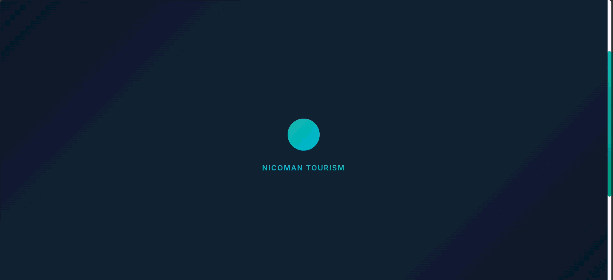
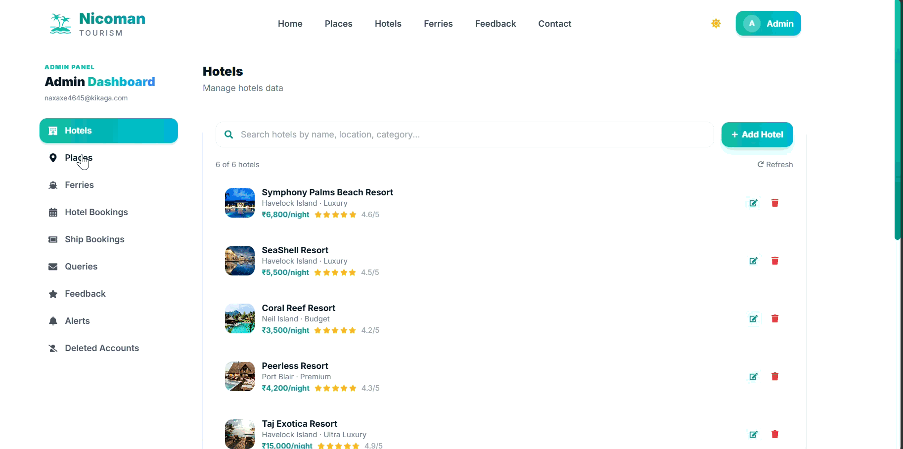
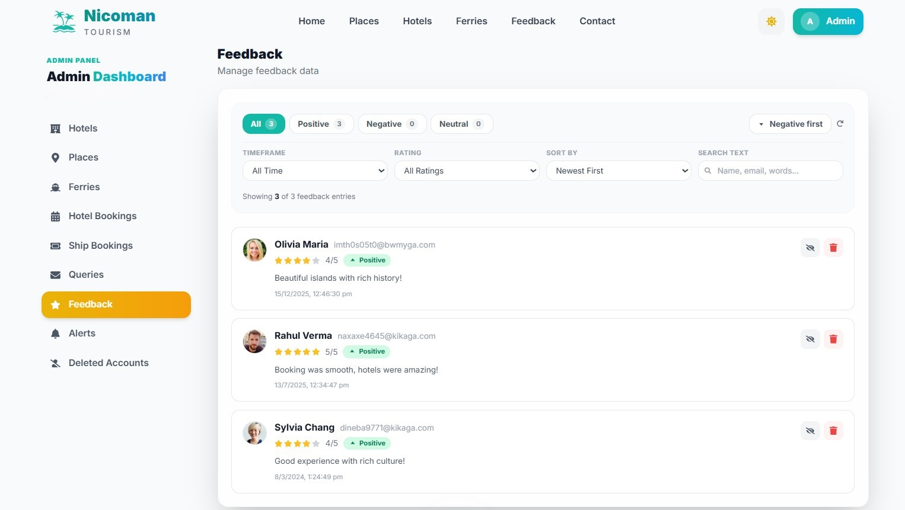
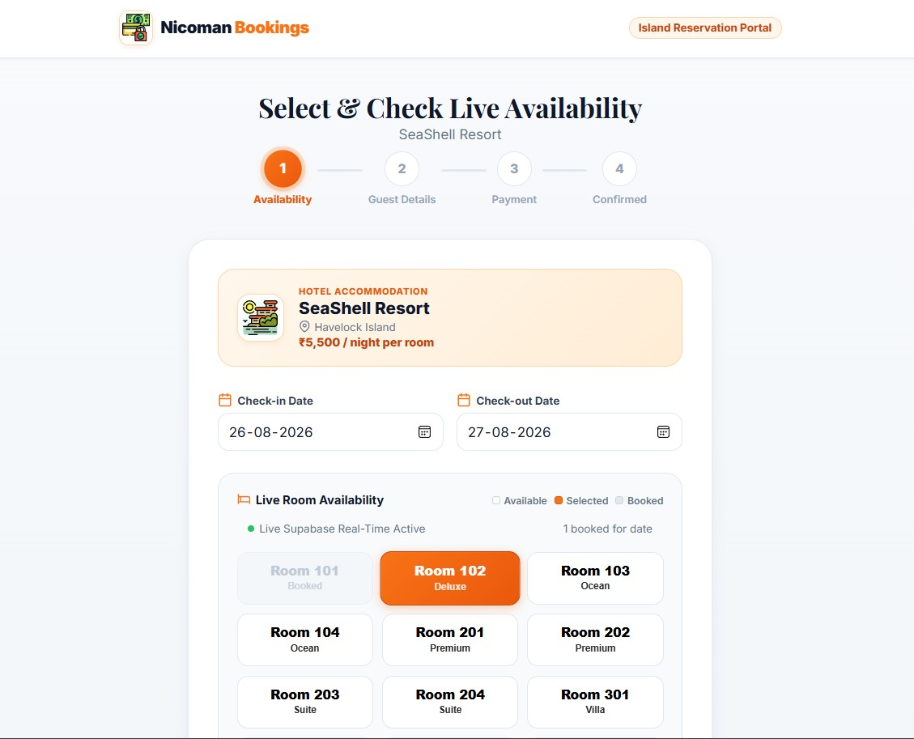
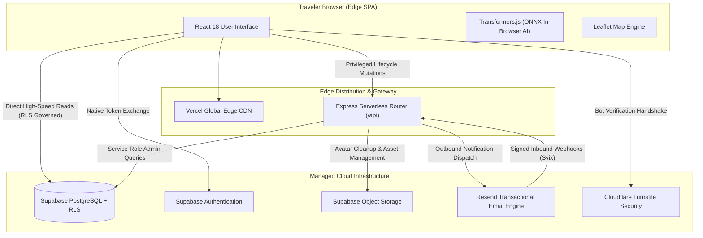
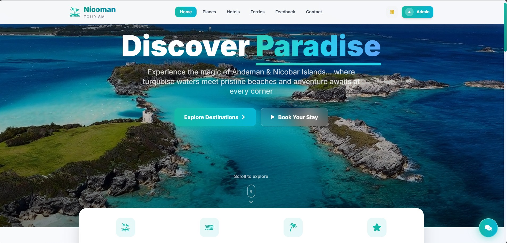
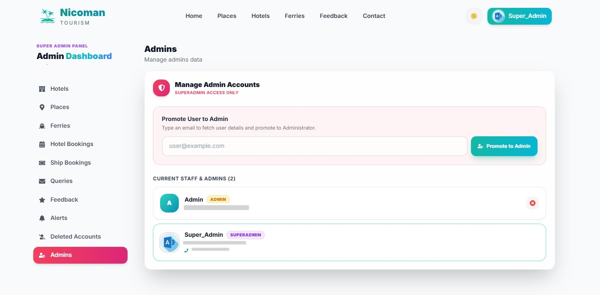

<div align="center">

[](https://nicoman-tourism.vercel.app)


<br/>
</div>

---

<div align="center">

[](https://nicoman-tourism.vercel.app)
[](https://nicoman-tourism.vercel.app)
[](https://react.dev/)
[](https://supabase.com/)
[](https://tailwindcss.com/)
[](https://nodejs.org/)

</div>

---

## Live Demonstration

Experience the live, zero-maintenance production deployment:

**Live URL:** [https://nicoman-tourism.vercel.app](https://nicoman-tourism.vercel.app)

### Demo Admin Access
Reviewers and visitors can explore the complete management command center without creating an account:

| Credential Field | Value |
| :--- | :--- |
| **Email** | `demoadmin@nicoman.com` |
| **Password** | `DemoPassword123!` |
| **Direct Sign-In URL** | [https://nicoman-tourism.vercel.app/auth](https://nicoman-tourism.vercel.app/auth) |

> *Demo admin accounts operate in a sandboxed preview state to protect live database records while enabling full interface inspection.*

---

## Feature Showcase

| Interactive Route Mapping | Admin Dashboard |
| :--- | :--- |
|  |  |
| *Real Island coordinates, category-colored pins, and live place details.* | *Fleet timetables, emergency alerts, and email ticket threads.* |

| On-Device AI Sentiment Scoring | Hotel Booking |
| :--- | :--- |
|  |  |
| *Browser-side review classification via Transformers.js.*| *Browse verified stays and check availability with a clean booking flow.* |

---

## Feature Highlights

### Discover
* **Curated Destination Guides:** Detailed attraction overviews with seasonal insights and interactive coordinates across Andaman.
* **Instant Faceted Search:** High-speed client-side filtering across accommodations and transport hubs without page reloads.
* **On-Device AI Assistant:** Intelligent travel companion grounded in live database catalogs, running inference entirely in the browser.

### Plan
* **Live Ferry Schedules:** Inter-island vessel timetables, tariffs, and route maps with automated status tracking.
* **Interactive Booking Flow:** Step-by-step room and seat reservation wizard with collision prevention and deterministic reference tokens.
* **Visitor Review Ecosystem:** Public feedback platform with automated on-device sentiment categorization.

### Manage
* **Fleet & Catalog Operations:** Comprehensive administrative management for vessel schedules, accommodation pricing, and attraction entries.
* **Two-Way Support Invoicing:** Unified customer inquiry inbox with automated outbound replies and inbound webhook thread matching.
* **30-Day Recovery Vault:** Self-service account deletion with automated grace-period archival and one-click restoration.

---

## Technology Stack

| Domain | Technology | Integration / Identity Badge |
| :--- | :--- | :--- |
| **Frontend Framework** | React 18 & Vite |  |
| **Styling & Motion** | Tailwind CSS & Framer Motion |  |
| **Database & Auth** | Supabase PostgreSQL & RLS |  |
| **Serverless API** | Node.js & Express Router |  |
| **Bot Security** | Cloudflare Turnstile |  |
| **Email Platform** | Resend & Svix Webhooks |  |
| **Geospatial Maps** | Leaflet & OpenStreetMap |  |
| **Client-Side AI** | ONNX Runtime Web & Transformers.js |  |

---

## System Architecture



---

## Interface Previews

| Desktop Exploration Portal | Super Admin Dashboard |
| :--- | :--- |
|  |  |
| *Immersive island guides, weather alerts, and interactive schedules.* | *Same as Admin Dashboard with extra admin maintenance section.* |

---

## Deliberately Out of Scope

* **Informational Authority vs. Direct Payment Gateway:** Financial checkout is isolated to a standalone reservation demonstration engine. Decoupling high-volume informational traffic from transactional workflows mirrors real-world travel authority infrastructure.
* **On-Device Machine Learning:** Sentiment analysis and chatbot intent grounding execute locally using WebAssembly and ONNX Runtime. This eliminates recurring third-party API costs and eliminates cloud latency while maintaining user data privacy.
* **Zero Dedicated Server Overhead:** Built entirely with serverless functions, static edge distribution, and managed PostgreSQL with Row Level Security, ensuring continuous operation with zero maintenance requirements.
---
## Technical Documentation

For in-depth architectural details, database schema explanations, PostgreSQL Row Level Security policies, and performance engineering rationale:

📖 **[Read the Complete Technical Architecture Document: PROJECT_IMPLEMENTATION.md](./PROJECT_IMPLEMENTATION.md)**

---

## Getting Started

### Prerequisites
* Node.js 18.x or higher
* npm 9.x or higher

### Local Development Setup

```bash
# 1. Clone the repository
git clone https://github.com/Manoj8541/Nicoman-Tourism.git
cd Nicoman-Tourism

# 2. Install all workspace dependencies
npm install
cd client && npm install
cd ../booking-demo && npm install
cd ..

# 3. Configure local environment variables
# Copy client/.env.example to client/.env and provide your project keys

# 4. Launch local development servers
npm run dev
```

---

## ⚖️ Legal, Media & Trademark Disclaimer

> [!NOTE]
> **Non-Commercial Educational & Portfolio Notice**
> 
> * **Educational & Demonstration Purpose:** This software application is developed exclusively for **non-commercial educational, engineering demonstration, and portfolio purposes**. No commercial transactions, booking monetization, or financial processing are conducted through this portal.
> * **Media, Photography & Trademarks:** All destination imagery, hotel photography, ferry vessel names, brand trademarks, and logos displayed within this repository and live demonstration are the property of their respective copyright and intellectual property owners. Visual assets are utilized under the **Fair Use** doctrine (Section 107 of the US Copyright Act and Section 52 of the Indian Copyright Act, 1957) for technological showcase and educational review.
> * **No Official Affiliation:** This project is an independent engineering development and is not officially affiliated with, authorized by, sponsored by, or endorsed by the Directorate of Tourism (Andaman and Nicobar Administration) or any private hotel/ferry operators mentioned herein.
> * **DMCA / Content Takedown Safe Harbor:** If you are the copyright owner of any image, media asset, or trademark referenced in this project and wish to have it credited, modified, or permanently removed, please submit a request via [GitHub Issues](https://github.com/Manoj8541/Nicoman-Tourism/issues). Any verified request will be addressed promptly in good faith.
> * **Limitation of Liability & "As-Is" Warranty:** The software and schedules provided herein are for demonstration simulation only and may not reflect real-time maritime conditions. The author assumes no legal liability for travel decisions or bookings made outside this demonstrative environment.

---

## ⭐ Support & Feedback

If you found this project helpful or inspiring, feel free to give it a **Star ⭐** on GitHub!

